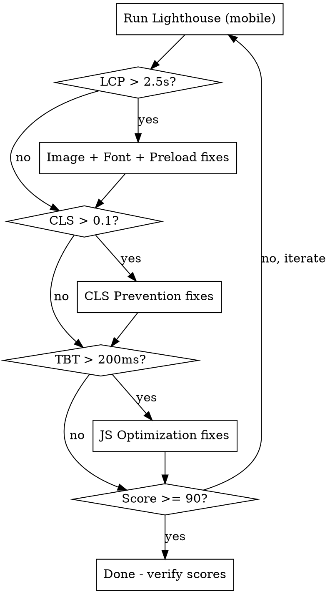

# Web Performance Optimization

Battle-tested techniques for static HTML/CSS/JS sites. Proven results: Mobile Lighthouse 73→91 (+18), Desktop 97→100, LCP 7.0s→0.9s (87% faster), TBT 170ms→0ms.

## When to Use

- Lighthouse Performance score below 90 (mobile) or 95 (desktop)
- LCP above 2.5s, CLS above 0.1, TBT above 200ms
- Before launching a new static site
- After adding new pages, images, or fonts
- When user reports "slow" page loads

## Audit-First Workflow



Always run Lighthouse in **mobile emulation** first — mobile is the harder target and exposes issues desktop hides.

```bash
# Run Lighthouse audit (mobile by default)
npx lighthouse <URL> --output=json --output=html --output-path=./lighthouse-report

# Run specifically for mobile
npx lighthouse <URL> --preset=perf --form-factor=mobile --screenEmulation.mobile

# Quick CLI check
npx lighthouse <URL> --only-categories=performance --output=json | jq '.categories.performance.score'
```

---

## 1. Font Optimization

**Impact: LCP, CLS, file size**

### Convert to WOFF2

WOFF2 is ~54% smaller than TTF. Never serve TTF to browsers.

```bash
# Convert TTF to WOFF2 (requires woff2 tools or fonttools)
pip install fonttools brotli
python3 -c "from fontTools.ttLib import TTFont; f=TTFont('font.ttf'); f.flavor='woff2'; f.save('font.woff2')"
```

### Subset Fonts

Only include characters actually used on the site. Dramatic size savings for display/script fonts.

```bash
# Subset to Latin characters
pip install fonttools brotli
pyftsubset font.ttf \
  --output-file=font-subset.woff2 \
  --flavor=woff2 \
  --layout-features='kern,liga,clig,calt' \
  --unicodes="U+0020-007F,U+00A0-00FF,U+2018-201D,U+2013-2014,U+2026,U+00B7"

# Subset to specific characters only (for decorative/script fonts)
pyftsubset font.ttf \
  --output-file=font-subset.woff2 \
  --flavor=woff2 \
  --text="Exact Characters Here"
```

### Font-Display Strategy

| Value | Behavior | When to Use |
|-------|----------|-------------|
| `swap` | Show fallback immediately, swap when loaded | **Default choice** — best CLS in practice |
| `optional` | May skip web font entirely | Sounds good, but causes MORE CLS in testing |
| `block` | Invisible text up to 3s | Almost never appropriate |

**Proven decision: Use `font-display: swap` on all @font-face declarations.** Testing showed `optional` caused CLS 0.691-0.905 vs `swap` at 0.006.

### Preload Critical Fonts

Preload fonts used above the fold:

```html
<link rel="preload" as="font" type="font/woff2" href="/fonts/Primary-Regular.woff2" crossorigin>
<link rel="preload" as="font" type="font/woff2" href="/fonts/Display-Regular.woff2" crossorigin>
```

The `crossorigin` attribute is **required** even for same-origin fonts — browsers fetch fonts in anonymous CORS mode.

---

## 2. Image Optimization

**Impact: LCP, file size, bandwidth**

### Convert to WebP

WebP is 25-35% smaller than JPEG at equivalent quality. Use quality 85-90 for photos.

```bash
# Single image conversion
cwebp -q 90 input.jpg -o output.webp

# Using Sharp (Node.js) — recommended for pipelines
node -e "
const sharp = require('sharp');
sharp('input.jpg')
  .webp({ quality: 90 })
  .toFile('output.webp');
"
```

### Responsive Images with srcset

Generate multiple sizes for different viewports. Never serve a 1200px image to a 300px mobile slot.

```html
<!-- Service card example -->

```

**Size breakpoints to generate:** Match your CSS layout breakpoints. Common set: 300px, 400px, 500px, 900px.

### Lazy Loading

Add `loading="lazy"` to ALL images below the fold. Never lazy-load the hero/LCP image.

```html
<!-- Hero image: eager load + high priority -->


<!-- Below-fold images: lazy load -->

```

### Preload LCP Image

The LCP image (usually hero) must be preloaded with media-query variants:

```html
<head>
  <!-- Mobile variant (smaller file) -->
  <link rel="preload" as="image" href="/images/hero-small.webp"
        media="(max-width: 767px)">
  <!-- Desktop variant -->
  <link rel="preload" as="image" href="/images/hero.webp"
        media="(min-width: 768px)">
</head>
```

### Image Dimensions & Aspect Ratio

**Always** set `width` and `height` attributes matching the actual file dimensions. The browser uses these to calculate aspect ratio and reserve space before the image loads.

```html
<!-- width/height match FILE dimensions, CSS controls display size -->

```

For responsive containers, use CSS `aspect-ratio`:

```css
.image-container img {
  aspect-ratio: 194 / 259;
  object-fit: cover;
  width: 100%;
  height: auto;
}
```

---

## 3. CSS Strategy

**Impact: CLS, FCP, render blocking**

### Keep CSS Synchronous

**Do NOT async-load your main stylesheet.** Testing showed async CSS + critical inline CSS caused CLS to spike from 0.006 to 0.905 — a 150x regression.

**Why:** Sites with initially-hidden elements (modals, popups, cookie banners, dropdowns) suffer massive layout shifts when the full stylesheet loads asynchronously and reveals/repositions those elements.

```html
<!-- CORRECT: synchronous CSS loading -->
<link rel="stylesheet" href="/css/main.css">

<!-- WRONG: async CSS causes CLS on sites with hidden elements -->
<link rel="preload" href="/css/main.css" as="style" onload="this.rel='stylesheet'">
```

### Critical Inline CSS for Hidden Elements

If any elements should be hidden on initial load, hide them in a small inline `<style>` block in `<head>`:

```html
<head>
  <style>
    /* Prevent FOUC for initially-hidden elements */
    .modal, .popup-overlay, .cookie-consent, .dropdown-menu { display: none; }
  </style>
  <link rel="stylesheet" href="/css/main.css">
</head>
```

### Minification & Bundling

Use your host's build processing (Netlify, Cloudflare, etc.) rather than manual build tools for static sites:

```toml
# Netlify example (netlify.toml)
[build.processing.css]
  bundle = true
  minify = true

[build.processing.js]
  bundle = true
  minify = true

[build.processing.images]
  compress = true
```

---

## 4. CLS Prevention

**Impact: CLS score directly. Target: < 0.1**

CLS is the hardest Core Web Vital to fix retroactively. These are the proven techniques:

### Use `hidden` Attribute, Not CSS

For elements that shouldn't participate in layout until shown (modals, promos, popups):

```html
<!-- CORRECT: completely removed from layout -->
<div id="promo-modal" hidden>...</div>

<!-- WRONG: still participates in layout, causes CLS -->
<div id="promo-modal" style="visibility: hidden; opacity: 0;">...</div>
```

The `hidden` attribute removes the element from the render tree entirely. CSS `visibility: hidden` and `opacity: 0` still reserve layout space.

### Image Dimension Matching

HTML `width`/`height` must match the **actual file pixel dimensions**, not the CSS display size. The browser calculates intrinsic aspect ratio from these attributes.

```html
<!-- File is 300x450 pixels, displayed at 194x259 CSS pixels -->

```

### Font-Display: Swap (Not Optional)

`font-display: optional` skips the web font if it's not cached, which sounds fast but causes **more CLS** because the layout shifts when different sessions render different fonts. `swap` is consistent: always loads the web font, always shifts once (imperceptibly with preloading).

### Reserve Space for Dynamic Content

For any content injected by JavaScript (ad slots, newsletter bars, notifications):

```css
.promo-bar-slot {
  min-height: 48px; /* Reserve space before JS populates */
}
```

---

## 5. JavaScript Optimization

**Impact: TBT, FCP, interactivity**

### Script Loading

```html
<!-- CORRECT: defer for all non-critical scripts -->
<script src="/js/main.js" defer></script>

<!-- For analytics/tracking: async is fine -->
<script src="https://www.googletagmanager.com/gtag/js" async></script>
```

`defer` guarantees execution order and runs after DOM parsing. Use it for all site JS.

### Passive Event Listeners

Every scroll, touch, and wheel handler must be passive to avoid blocking the main thread:

```javascript
window.addEventListener('scroll', handleScroll, { passive: true });
window.addEventListener('mousemove', handleMouse, { passive: true });
window.addEventListener('resize', handleResize, { passive: true });
```

### requestAnimationFrame for Visual Updates

Batch DOM reads/writes into animation frames:

```javascript
window.addEventListener('scroll', () => {
  requestAnimationFrame(() => {
    header.style.transform = `translateY(${offset}px)`;
  });
}, { passive: true });
```

### IntersectionObserver for Lazy Behavior

Replace scroll-position checks with IntersectionObserver:

```javascript
const observer = new IntersectionObserver((entries) => {
  entries.forEach(entry => {
    if (entry.isIntersecting) {
      entry.target.src = entry.target.dataset.src;
      observer.unobserve(entry.target);
    }
  });
}, { rootMargin: '50px' });

document.querySelectorAll('img[data-src]').forEach(img => observer.observe(img));
```

---

## 6. Resource Hints

**Impact: LCP, connection latency**

```html
<head>
  <!-- Preconnect: full DNS + TCP + TLS handshake (use for critical third parties) -->
  <link rel="preconnect" href="https://fonts.googleapis.com">
  <link rel="preconnect" href="https://fonts.gstatic.com" crossorigin>

  <!-- DNS-prefetch: DNS only (use for non-critical third parties) -->
  <link rel="dns-prefetch" href="https://www.googletagmanager.com">
  <link rel="dns-prefetch" href="https://external-service.com">
</head>
```

**Rule of thumb:** Preconnect for resources needed in the first 3 seconds. DNS-prefetch for everything else external.

---

## 7. Caching Strategy

**Impact: Repeat visit speed, bandwidth**

| Asset Type | Cache-Control | Why |
|-----------|---------------|-----|
| HTML | `public, max-age=0, must-revalidate` | Always serve latest content |
| CSS/JS | `public, max-age=0, must-revalidate` | Always serve latest code (no filename hashing on static sites) |
| Images | `public, max-age=7776000, must-revalidate` | 3 months cache, but revalidate on change |
| Fonts | `public, max-age=7776000, must-revalidate` | 3 months cache, fonts rarely change |

For **Netlify** (`_headers` file or `netlify.toml`):

```toml
[[headers]]
  for = "/*.html"
  [headers.values]
    Cache-Control = "public, max-age=0, must-revalidate"

[[headers]]
  for = "/images/*"
  [headers.values]
    Cache-Control = "public, max-age=7776000, must-revalidate"

[[headers]]
  for = "/fonts/*"
  [headers.values]
    Cache-Control = "public, max-age=7776000, must-revalidate"
```

For **Cloudflare Pages** (`_headers` file):

```
/*.html
  Cache-Control: public, max-age=0, must-revalidate

/images/*
  Cache-Control: public, max-age=7776000, must-revalidate

/fonts/*
  Cache-Control: public, max-age=7776000, must-revalidate

/css/*
  Cache-Control: public, max-age=0, must-revalidate

/js/*
  Cache-Control: public, max-age=0, must-revalidate
```

---

## 8. Deploy Optimization

**Impact: Build time, deploy size, bandwidth costs**

### Exclude Source Assets from Deploys

Keep raw/source files in git for team sync, but exclude from production:

```
# .netlifyignore or equivalent
/source-assets/
/images/fallback/
/images/originals/
fonts/*.ttf
*.psd
*.sketch
```

### Deploy Only Production Formats

| Keep in repo | Deploy to production |
|-------------|---------------------|
| TTF source fonts | WOFF2 only |
| Original PNGs/JPGs | Optimized WebP only |
| Raw DSLR photos | Resized responsive variants |
| Design files | Nothing |

---

## Quick Optimization Checklist

Run through this for any page:

| Check | Target | How to Fix |
|-------|--------|------------|
| Hero image preloaded? | Yes, with media queries | Add `<link rel="preload">` in `<head>` |
| Hero image has `fetchpriority="high"`? | Yes | Add attribute to LCP image |
| All below-fold images lazy? | `loading="lazy"` on all | Add attribute |
| Images have width/height? | Matching file dimensions | Set from actual pixel size |
| Images in WebP format? | All served as WebP | Convert with cwebp or Sharp |
| Responsive srcset? | For images > 400px display | Generate size variants |
| Fonts in WOFF2? | No TTF served | Convert with fonttools |
| Fonts preloaded? | Above-fold fonts only | Add `<link rel="preload">` |
| font-display: swap? | All @font-face | Check CSS |
| Scripts deferred? | All site JS | Add `defer` attribute |
| Scroll listeners passive? | All of them | `{ passive: true }` |
| Modals/popups use `hidden`? | Not just CSS hiding | Use HTML `hidden` attribute |
| CSS loaded synchronously? | Yes, not async | Regular `<link rel="stylesheet">` |
| Cache headers set? | Per asset-type table above | Configure in host headers |
| Source assets excluded from deploy? | Yes | Add to .netlifyignore / .gitignore |

## Common Mistakes

| Mistake | Why It's Wrong | Fix |
|---------|---------------|-----|
| Async CSS loading | Causes massive CLS (0.9+) on sites with hidden elements | Keep CSS synchronous |
| `font-display: optional` | Counter-intuitively causes MORE CLS than `swap` | Use `swap` |
| `visibility: hidden` for modals | Element still participates in layout | Use `hidden` attribute |
| HTML width/height set to display size | Browser calculates wrong aspect ratio | Match file pixel dimensions |
| Lazy-loading the hero image | Delays LCP — the most important image | Use `fetchpriority="high"` instead |
| Preloading all fonts | Wastes bandwidth, delays critical resources | Only preload above-fold fonts |
| No `crossorigin` on font preload | Browser makes two requests (one wasted) | Always add `crossorigin` |
| Scroll handlers without passive | Blocks main thread, increases TBT | Add `{ passive: true }` |
| Serving TTF to browsers | 54% larger than WOFF2 | Convert to WOFF2 |
| No cache headers | Every visit re-downloads everything | Set per asset-type policy |

## Lighthouse Targets

| Metric | Good | Needs Work | Poor |
|--------|------|------------|------|
| Performance | 90+ | 50-89 | < 50 |
| LCP | < 2.5s | 2.5-4.0s | > 4.0s |
| CLS | < 0.1 | 0.1-0.25 | > 0.25 |
| TBT | < 200ms | 200-600ms | > 600ms |
| FCP | < 1.8s | 1.8-3.0s | > 3.0s |
